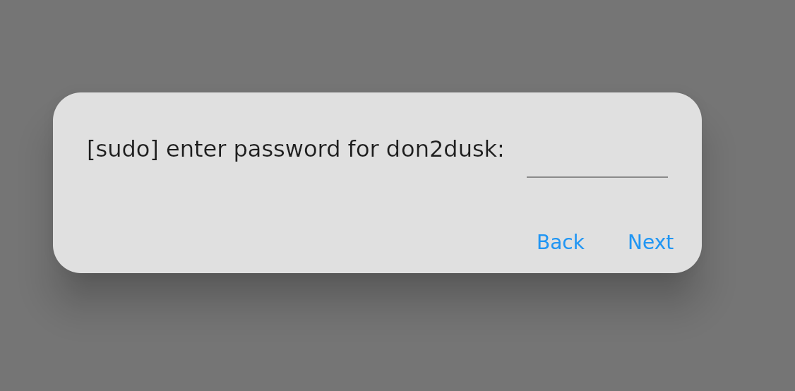
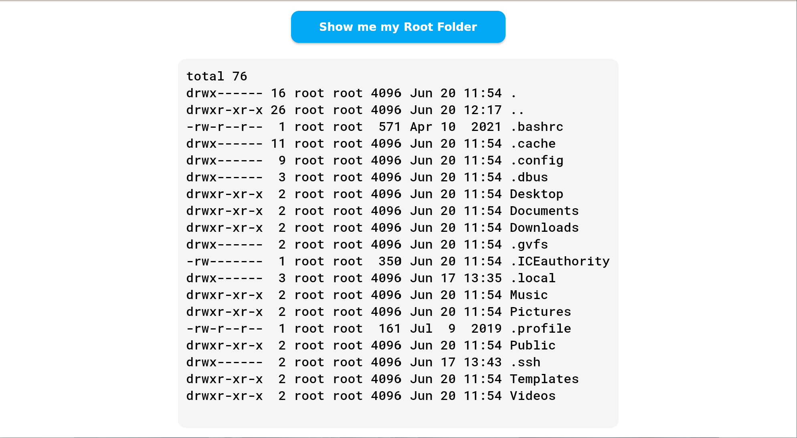

# Flutter Rust App with Privilege Elevation

This application incorporates Rust code for executing privileged operations using `sudo` or `polkit` (if available). This combination of Flutter and Rust allows for a powerful and secure application with elevated privileges when necessary.

## Prerequisites

Make sure you have the following installed before proceeding:

- Flutter SDK: [Installation Guide](https://flutter.dev/docs/get-started/install)
- Rust Toolchain (comes with the compiler): [Installation Guide](https://www.rustup.rs)
- C/C++ Compiler (for building Rust FFI): Ensure you have a compatible C/C++ compiler for your platform.
- [flutter-rust-bridge flutter package](https://pub.dev/packages/flutter_rust_bridge)

## Getting Started

To run the Flutter Rust app with privilege elevation, follow these steps:

1. Clone the repository:

2. Navigate to the project directory:

3. Run the Just command code:

   ```bash
    just gen
   ```

4. Build and run the Flutter app:

   ```bash
   flutter run
   ```

## Screenshots
|  |
|:--:|
| *The welcome screen the user is greeted with when opening the application* |

|  |
|:--:|
| *This button prompts the user to enter their password. It elevates privilege with the sudo command* |

|  |
|:--:|
| *The dialog that allows the user input their password* |

|  |
|:--:|
| *The results displayed on the screen* |