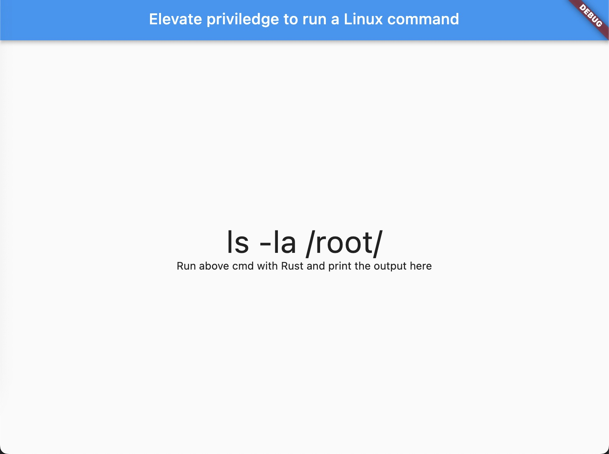
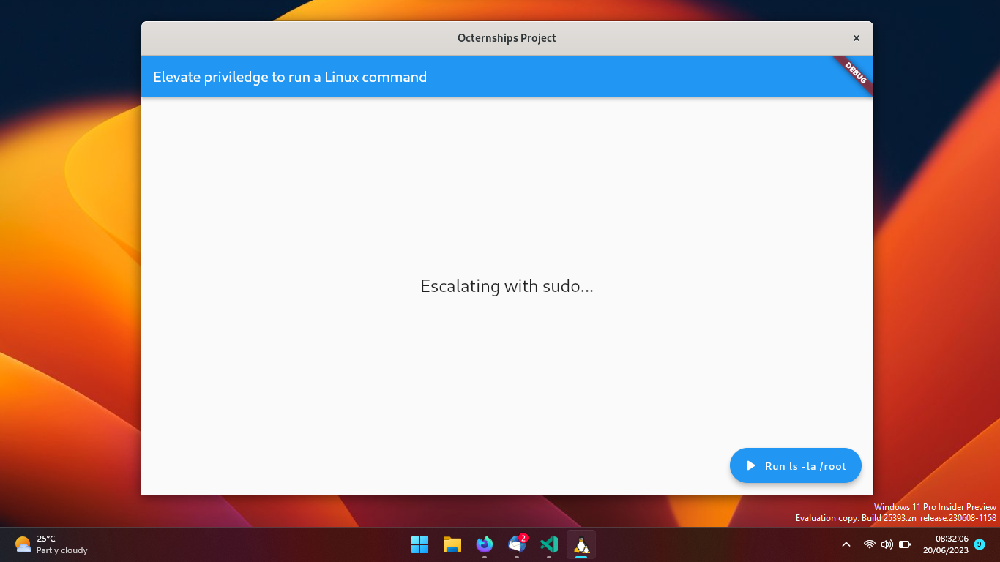
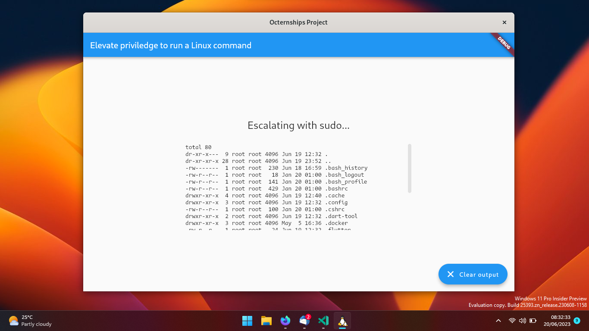

# Rustdesk Octernship Submission

This is my submission for the [Rustdesk Octernship]() application. 

The task was to "Elevate priviledge to run `ls -la /root/` with Rust, and print the result on the Flutter window".

|  |
|:--:|
| *The example image* |

## My implementation details

I made a simple Flutter app that checks for the existence of `polkit`, `sudo`, and `su` in order to carry out the privilege escalation. It then only offers to use those that are available (though, `sudo` and `su` are very ubiquitous so it is unlikely for a Linux system to not have both).

The application also allows for the command to be ran without any form of escalation, in case it was launched from a privileged context (and therefore wouldn't need escalation).

## Media

|  |
|:--:|
| *The main page of the application* |

|  |
|:--:|
| *The authentication dialog* |

|  |
|:--:|
| *The output after authenticating* |
## How to build

- Clone the repository and change directories
- Ensure you have the dependencies:
    - Flutter ([with Linux desktop support](https://docs.flutter.dev/get-started/install/linux))
    - a [Rust toolchain](https://rustup.rs/)
    - the [`just` command runner](https://github.com/casey/just)
    - [`flutter_rust_bridge_codegen`](https://crates.io/crates/flutter_rust_bridge_codegen/)

- Run `just` to ensure the generated bindings are up to date
- Run `flutter run` to run the application
